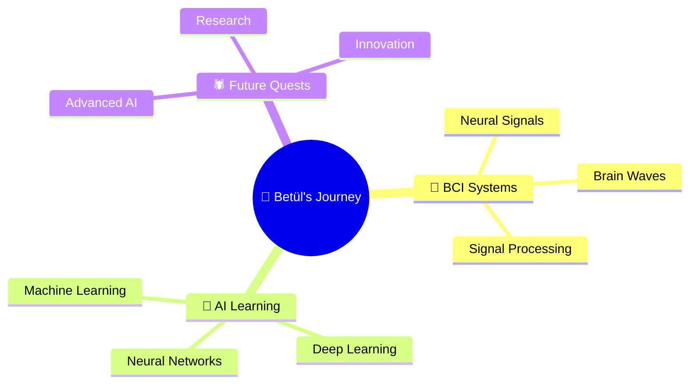

# 🎃 Welcome to My Haunted Code Lab 🎃

<div align="center">
  
```ascii
    ___                            ___
   /   \                          /   \
  | ◉ ◉ |    Welcome Brave Soul  | ◉ ◉ |
   \___/                          \___/
     |                              |
    /|\          to the            /|\
   / | \      Digital Realm       / | \
    / \          of              / \
```

### 🦇 Betül - AI Sorcerer & Code Conjurer 🦇

[](https://git.io/typing-svg)

</div>

---

## 🕷️ About This Mystical Being 🕷️

```python
class AIWitch:
    def __init__(self):
        self.name = "Betül"
        self.current_realm = "BCI Systems 🧠"
        self.learning_spells = ["Artificial Intelligence", "Neural Networks"]
        self.magic_level = "Ascending"
        
    def cast_spell(self):
        return "Transforming neurons into intelligence ✨"
```

<div align="center">

🔮 **Currently Conjuring:** Brain-Computer Interface Systems  
🌙 **Learning Dark Arts:** Artificial Intelligence & Deep Learning  
🕯️ **Favorite Potion:** Coffee ☕ (Keeps the spirits alive)

</div>

---

## 🎃 My Enchanted Arsenal 🎃

<div align="center">

### 🧙‍♀️ Spellbooks & Incantations


### 🦴 Tools from the Crypt


</div>

---

## 🕸️ GitHub Graveyard Stats 🕸️

<div align="center">


</div>

---

## 🌑 Current Rituals 🌑

<div align="center">



</div>

---

## 👻 Haunted Projects 👻

<div align="center">

🔮 *Brewing something mysterious...*  
🧪 *Projects rising from the digital grave soon...*  
⚡ *Stay tuned for magical creations!*

</div>

---

## 🦇 Connect in the Shadow Realm 🦇

<div align="center">

[](https://github.com/betuullm)
[](mailto:your-email@example.com)

</div>

---

<div align="center">

### 🎃 Trick or Treat? Choose Collaboration! 🎃

```ascii
     .--.                    .--.
    ( (`'.\                /.'`) )
     '.    `'.          .'`    .'
       '.    '.        .'    .'
         '.__.`-._  _.-`.__.'
              `'||_||'`
               _||||_
              (______)
       _______|______|_______
      |  Thanks for visiting! |
      |________________________|
```


**"In code we trust, in AI we conjure"** ✨

</div>

---

<div align="center">
  
*🕷️ May your code be bug-free and your commits be plentiful 🕷️*

⭐ **If you dare, star my repositories!** ⭐

</div>
